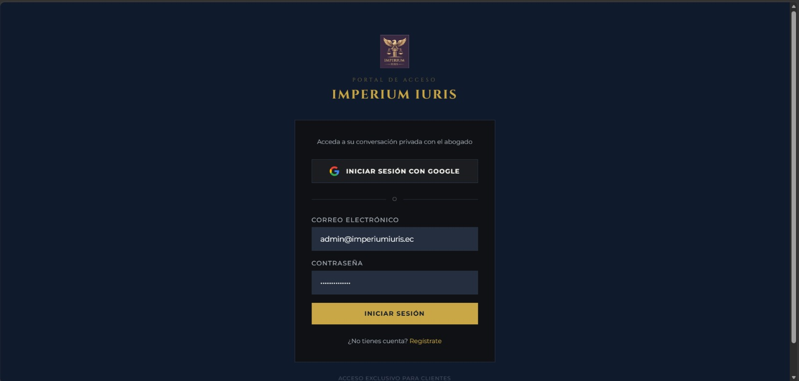
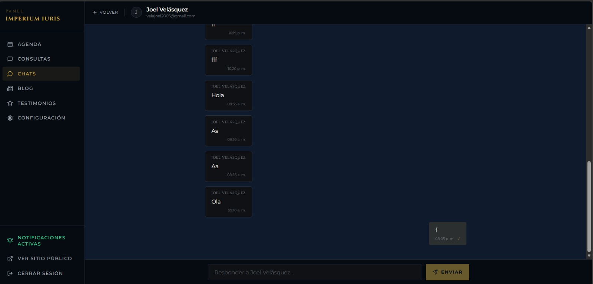
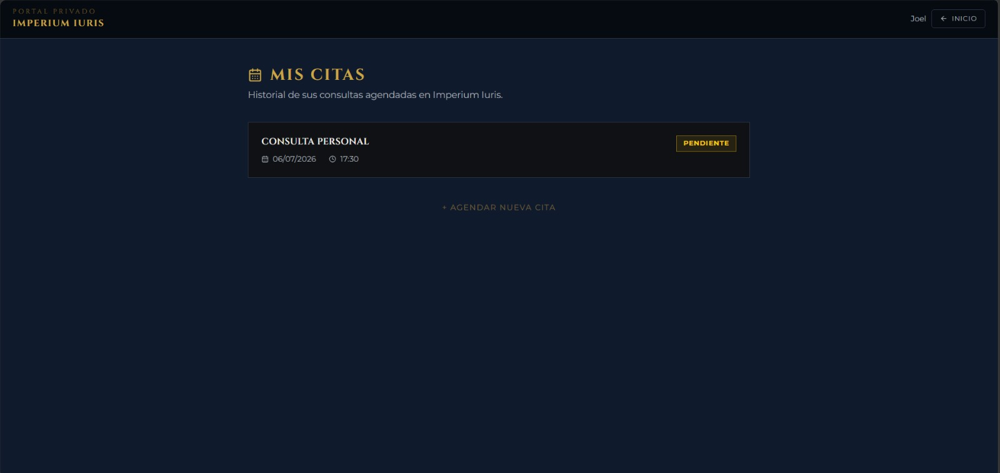
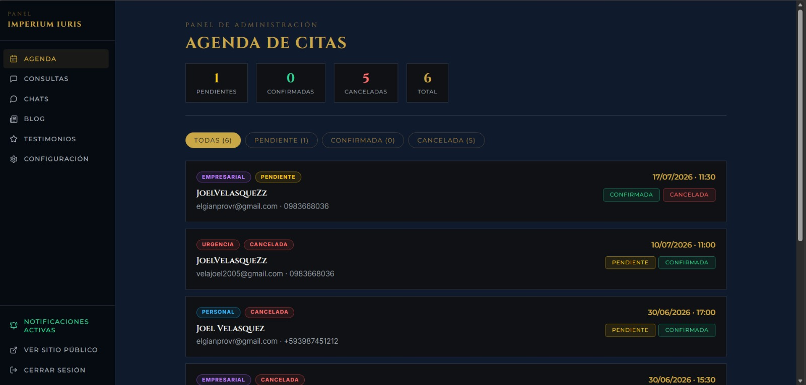
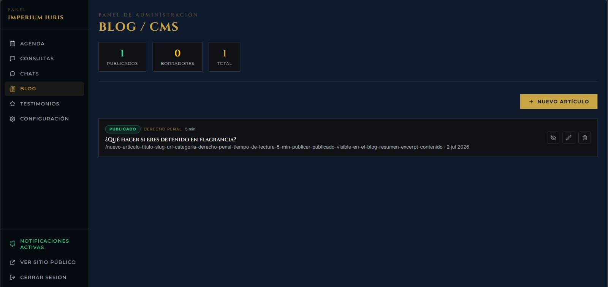
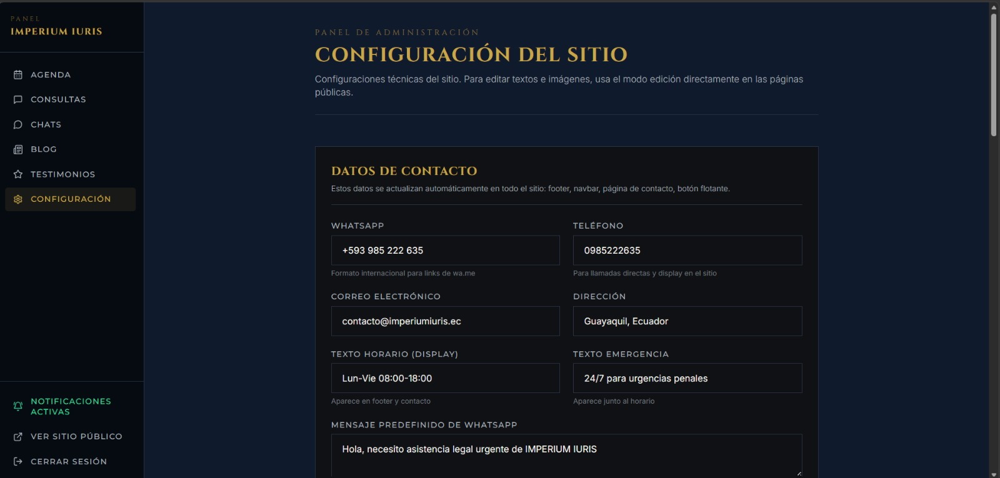

# Documentación del Proyecto — Imperium Iuris

> Este documento explica **qué es** Imperium Iuris y **cómo está construido**, pensado para quien se une al proyecto por primera vez. Para instrucciones de instalación, variables de entorno y despliegue, ver la guía del programador (`docs/GUIA_PROGRAMADOR.md`). Para cómo operar el panel día a día, ver el manual de usuario.
>
> La referencia técnica de trabajo para el día a día de desarrollo (convenciones, rutas exactas, esquema de Supabase) vive en `CLAUDE.md`, en la raíz del repo — este documento la complementa en forma de recorrido narrativo, no la reemplaza.

## Qué es Imperium Iuris

Imperium Iuris es el portal web de un despacho de defensa penal estratégica: sitio público de captación de clientes, un sistema de agenda de citas, un panel de administración para el equipo del despacho, y un portal privado donde los clientes ya registrados pueden hacer seguimiento de sus casos y chatear en tiempo real con su abogado.

**Producción:** https://imperiumiuris.ec

**Stack:** Next.js 15.3 (App Router) · TypeScript en modo `strict` · Tailwind CSS · Framer Motion · Supabase (base de datos, auth, storage, realtime) · Resend (emails transaccionales) · Vercel (hosting).

## Estado actual

| Módulo | Estado | Qué hace |
|--------|--------|----------|
| Sitio web público | ✅ | Home, Nosotros, Servicios, Blog, Contacto, Agenda |
| Emails automáticos | ✅ | Confirmación al cliente + notificación al abogado (Resend) |
| Agenda online | ✅ | Reserva de citas con disponibilidad en tiempo real |
| Panel de administración | ✅ | Auth, gestión de citas/consultas, CMS de blog, moderación de testimonios |
| Portal de cliente | ✅ | Login con Google, chat en tiempo real, historial de citas, 2FA opcional |
| Edición inline | ✅ | El admin edita textos e imágenes del sitio público sin tocar código |
| Notificaciones push | ✅ | El admin recibe una notificación del navegador ante cita/consulta/mensaje nuevo |

El detalle de qué falta o quedó a medias está en la sección **"Módulos y estado del proyecto"** más abajo.

---

## Recorrido del sitio público

Todas las páginas públicas leen su contenido editable (títulos, textos, imágenes) de la tabla `configuracion` de Supabase a través de `getSiteConfig()` — ver la sección "Arquitectura y flujos clave" para el detalle de cómo funciona la edición en vivo.

### Home (`/`)

La página de aterrizaje: hero con la propuesta de valor del despacho, bloque de confianza (`trust_block`), áreas de práctica (`services_block`), bloque de urgencia con los tres escenarios más comunes por los que alguien contacta a un abogado penalista (`urgency_block`), diferenciales del despacho (`differential_block`), testimonios de clientes (`testimonials_block`, solo lee testimonios con `estado = 'aprobado'`), preview de los últimos artículos del blog, y una llamada a la acción final (`final_cta`).

### Nosotros (`/nosotros`)

Página institucional: apertura/misión, filosofía de trabajo, por qué elegir al despacho, presentación del equipo, metodología de trabajo en 6 pasos, compromiso de confidencialidad, y una llamada a la acción de cierre. Todo editable vía inline editing (`nosotros_page`, `por_que_block`, `equipo_block`, `metodologia_block`, `confidencialidad_block`, `cta_nosotros`).

### Servicios (`/servicios`)

Detalle de las áreas de práctica del despacho.

### Blog (`/blog` y `/blog/[slug]`)

Blog jurídico. El listado (`/blog`) lee de la tabla `articulos` en Supabase, solo artículos con `publicado = true`. Cada artículo individual (`/blog/[slug]`) se identifica por su `slug` único y su contenido se guarda en Markdown, sanitizado antes de renderizarse (`lib/sanitize.ts`).

### Contacto (`/contacto`)

Formulario de consulta general. Al enviarse, guarda el registro en la tabla `consultas`, dispara un email de confirmación al cliente y una notificación al abogado (ambos vía Resend, `Promise.allSettled` — un fallo de email no bloquea el guardado), y está protegido por rate limiting (`lib/rate-limit.ts`) para evitar spam.

### Agenda (`/agenda`)

Formulario de reserva de citas. Calcula disponibilidad en tiempo real según el horario de citas configurado (`horario_citas`) y los días festivos (`festivos`), respetando la zona horaria de Ecuador (`America/Guayaquil`, sin horario de verano). Igual que Contacto, guarda en Supabase (tabla `citas`) y dispara los emails correspondientes.

---

## Portal de cliente

A diferencia del sitio público, estas páginas requieren que el visitante inicie sesión. El proyecto usa un único proyecto de Supabase Auth tanto para clientes como para el admin (ver "Arquitectura y flujos clave" para cómo se distinguen).

### Ingreso (`/login`)

Dos formas de iniciar sesión: con Google OAuth (el callback en `/auth/callback` intercambia el código de Google por una sesión de Supabase), o con correo y contraseña, con un enlace a `/registro` para crear cuenta nueva. Solo el login por contraseña pasa por la verificación en dos pasos descrita abajo — el login con Google no la dispara.

### Verificación en dos pasos (`/cuenta/seguridad`)

El cliente puede activar opcionalmente un segundo factor de autenticación (TOTP, usando el soporte nativo de MFA de Supabase Auth — compatible con apps como Google Authenticator) desde `/cuenta/seguridad`. Si lo activa, el login por correo y contraseña pide el código de 6 dígitos después de validar la contraseña (a menos que el dispositivo ya esté marcado como confiable); el login con Google no pasa por esta verificación. Permite generar el código QR/secreto, verificar el primer código para activarlo, o desactivarlo.

Para no pedir el código en cada inicio de sesión desde el mismo navegador, existe un mecanismo de **dispositivo confiable** (`lib/trusted-device.ts` y `lib/trusted-device-server.ts`): al verificar el 2FA una vez, el servidor emite un token firmado que el navegador guarda en `localStorage`; en logins posteriores, el navegador manda ese token a `/api/auth/trusted-device/verify` y, si es válido, se salta el paso del código.

### Chat con el abogado (`/chat`)

Mensajería en tiempo real entre el cliente y el abogado, usando Supabase Realtime sobre la tabla `mensajes`. El admin ve y responde estos chats desde `/admin/chats`.

### Mis citas (`/mis-citas`)

Historial de las citas agendadas por el cliente autenticado (se asocian por `cliente_id`, la columna que conecta `citas` con `auth.users`).

---

## Panel de administración

Todas las rutas bajo `/admin/*` requieren sesión con `role === 'admin'` (o el correo configurado en `ADMIN_EMAIL`) — el `middleware.ts` redirige a `/admin/login` si no hay sesión válida.

### Agenda (`/admin/agenda`)

Ver y gestionar todas las citas agendadas: cambiar su estado entre `pendiente`, `confirmada` y `cancelada`.

### Consultas (`/admin/contacto`)

Leer los mensajes recibidos por el formulario de contacto y marcarlos como `nueva`, `revisada` o `respondida`.

### Blog (`/admin/blog`)

CMS del blog: crear, editar y publicar/despublicar artículos, con un editor de texto enriquecido (TipTap).

### Testimonios (`/admin/testimonios`)

Aprobar o rechazar los testimonios enviados por clientes antes de que aparezcan en el sitio público (solo se muestran los que tienen `estado = 'aprobado'`).

### Chats (`/admin/chats` y `/admin/chats/[clienteId]`)

Lista de conversaciones de clientes y la vista de chat individual para responder — la contraparte de `/chat` en el portal de cliente.

### Configuración (`/admin/configuracion`)

Configuraciones técnicas del sitio que no son parte de la edición inline: datos de contacto (WhatsApp, teléfono, correo, dirección), redes sociales, horario de atención (controla el botón flotante) y horario de citas + días festivos.

> El resto del contenido del sitio (textos, imágenes de hero, testimonios destacados, etc.) no se edita aquí — se edita directamente sobre el sitio público con el modo de edición inline. Ver la siguiente sección.
